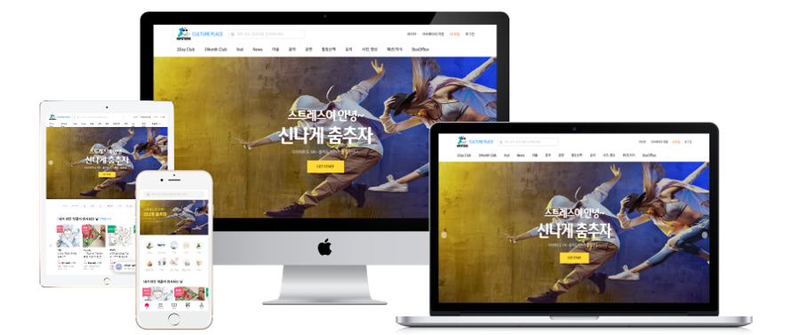
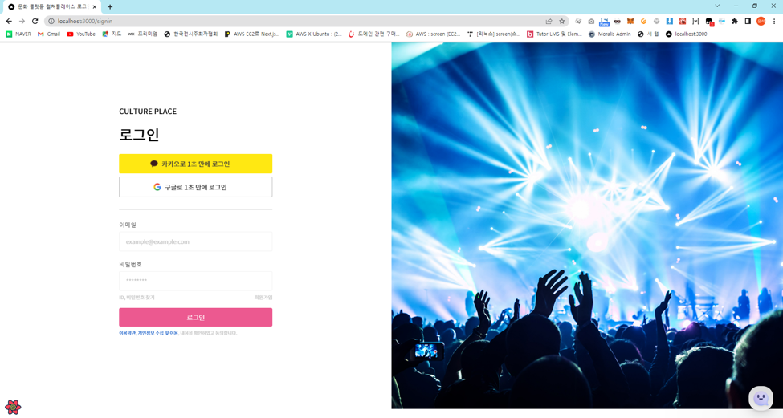
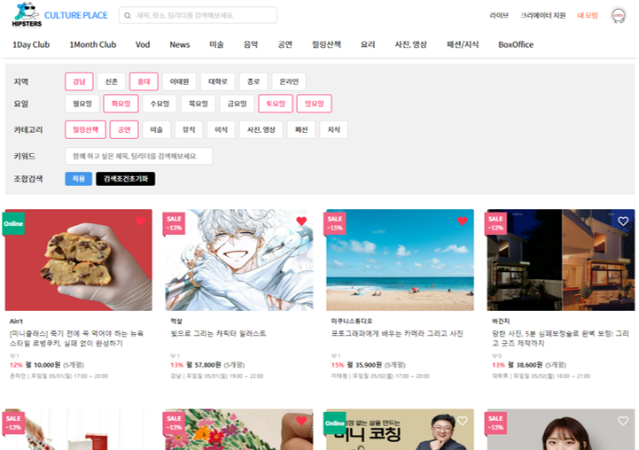
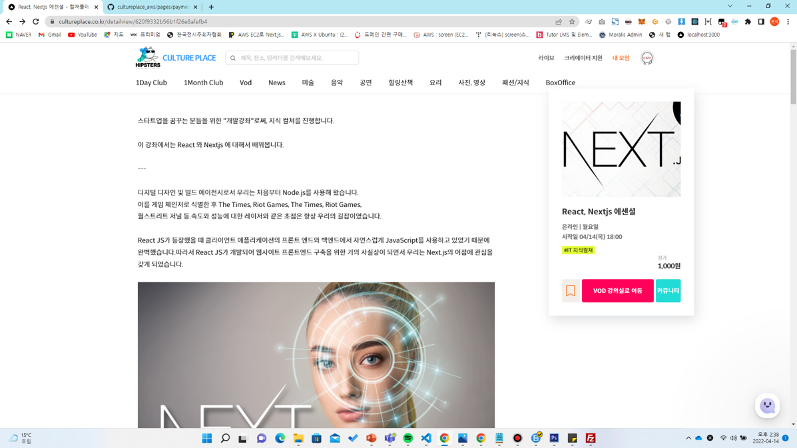
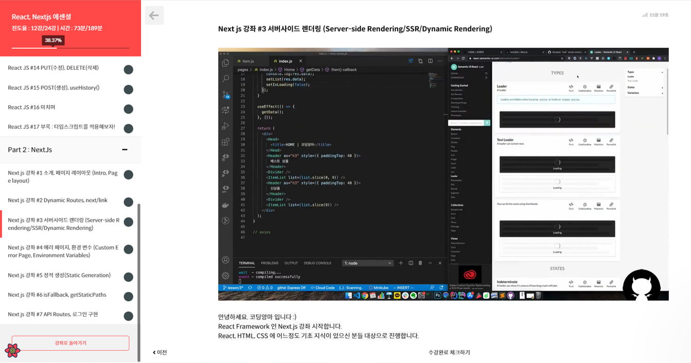
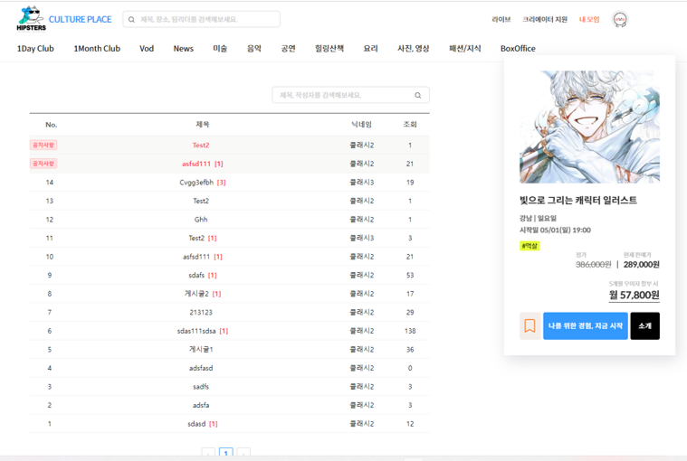
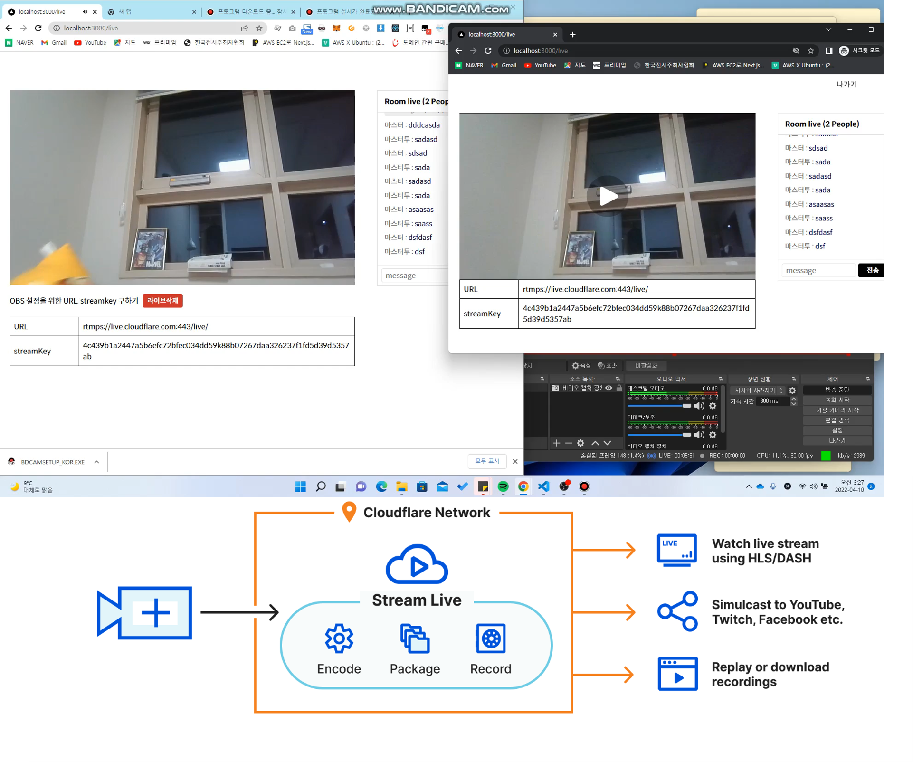
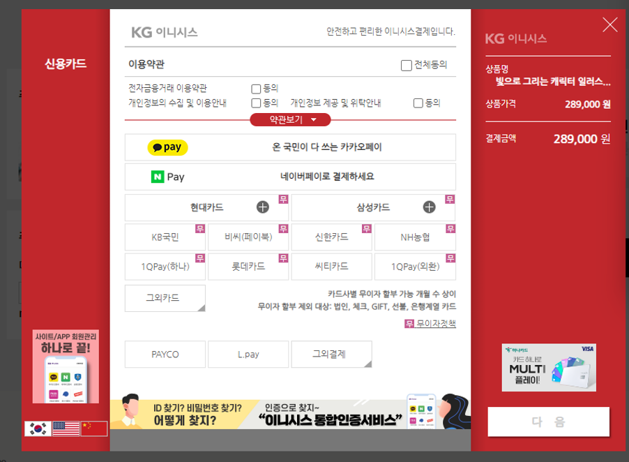

# 컬처플레이스 (CulturePlace)

## 🎨 UI 데모
<div>

<div>
  
  <div align="center">반응형 웹 디자인</div>
</div>

<div>
  
  <div align="center">메인 화면</div>
</div>

<div>
  
  <div align="center">소셜/이메일 로그인 (NextAuth)</div>
</div>

<div>
  
  <div align="center">상품 조합 & 필터</div>
</div>

<div>
  
  <div align="center">상품 상세페이지</div>
</div>

<div>
  
  <div align="center">VOD 콘텐츠</div>
</div>

<div>
  
  <div align="center">커뮤니티 & Q&A</div>
</div>

<div>
  
  <div align="center">라이브 스트리밍</div>
</div>

<div>
  
  <div align="center">결제 시스템</div>
</div>

</div>

컬처플레이스는 사용자들에게 다양한 문화 경험과 활동을 연결해주는 종합 온라인 플랫폼입니다. 미술 수업부터 댄스 워크샵, 음악 레슨, 연극 공연까지, 이 플랫폼은 사용자들이 자신의 관심사에 맞는 문화 활동을 발견하고, 예약하고, 참여할 수 있게 해줍니다.

## ✨ 주요 기능

### 🧩 사용자를 위한 기능
- **장르별 활동 탐색**: 미술, 댄스, 음악, 연극, 음식, 지혜, 힐링과 같은 카테고리별로 활동 찾기
- **사용자 프로필**: 개인 취향과 예약 내역을 포함한 프로필 생성 및 관리
- **안전한 결제 프로세스**: 토스페이먼츠와 통합된 원활한 거래 시스템
- **라이브 및 VOD 콘텐츠**: 실시간 스트리밍 및 주문형 비디오 문화 콘텐츠 접근
- **커뮤니티 기능**: 토론 참여 및 경험 공유
- **블로그 및 공지사항**: 최신 문화 트렌드와 플랫폼 소식 확인

### 👩‍🎨 크리에이터를 위한 기능
- **콘텐츠 관리**: 문화 활동 및 코스를 쉽게 업로드하고 관리
- **분석 기능**: 성과 및 참여 지표 추적
- **결제 관리**: 수익 및 거래 내역 모니터링

### 👨‍💼 관리자를 위한 기능
- **종합 관리자 패널**: 사용자, 콘텐츠 및 플랫폼 운영 관리
- **콘텐츠 조정**: 모든 플랫폼 콘텐츠의 품질 및 적절성 보장
- **시스템 분석**: 플랫폼 성능 및 사용자 참여 모니터링

## 🛠️ 기술 스택

### 프론트엔드
- **Next.js**: 서버 사이드 렌더링 및 정적 사이트 생성을 위한 React 프레임워크
- **TypeScript**: 타입 안전성과 개선된 개발자 경험을 위한 언어
- **Emotion**: 컴포넌트 기반 스타일링을 위한 CSS-in-JS 라이브러리
- **MobX**: 반응형 애플리케이션 상태를 위한 상태 관리 라이브러리
- **React Query**: React 애플리케이션을 위한 데이터 동기화
- **Chart.js**: 대화형 데이터 시각화
- **Swiper**: 모바일 인터페이스를 위한 터치 슬라이더

### 백엔드
- **Next.js API Routes**: 서버리스 API 엔드포인트
- **MongoDB with Mongoose**: 데이터 지속성을 위한 데이터베이스 및 ODM
- **NextAuth.js**: Next.js 애플리케이션을 위한 인증 솔루션
- **AWS S3**: 미디어 파일을 위한 클라우드 스토리지
- **Socket.io**: 실시간 양방향 이벤트 기반 통신

### 결제 처리
- **토스페이먼츠(Toss Payments)**: 안전한 결제 처리 통합


### 콘텐츠 관리
- **Toast UI Editor**: 리치 콘텐츠 생성을 위한 WYSIWYG 에디터
- **React Markdown**: 콘텐츠 표시를 위한 마크다운 렌더링


## 📌 주요 개발 특징

### 💬 실시간 채팅 시스템
- **Socket.io 기반 채팅**: 사용자와 크리에이터 간 실시간 커뮤니케이션 구현
- **채팅 기록 관리**: 대화 내역 저장 및 검색 기능
- **알림 시스템**: 새 메시지 및 중요 이벤트에 대한 실시간 알림

### 🎥 WebRTC 기반 라이브 스트리밍
- **@cloudflare/stream-react 활용**: 고품질 라이브 스트리밍 서비스 구현
- **양방향 상호작용**: 실시간 Q&A 및 댓글 기능을 통한 참여자 상호작용
- **VOD 변환**: 라이브 세션 자동 녹화 및 VOD 콘텐츠로 변환

### 💰 안전한 결제 시스템
- **토스페이먼츠 통합**: 국내 환경에 최적화된 결제 시스템 구현
- **결제 로그 추적**: 모든 거래의 상세 기록 유지 및 관리
- **환불 프로세스**: 자동화된 환불 처리 시스템

### 📝 콘텐츠 관리 시스템
- **Toast UI Editor**: 크리에이터를 위한 직관적인 콘텐츠 에디터 제공
- **미디어 업로드**: AWS S3를 활용한 이미지, 비디오 등 미디어 파일 관리
- **콘텐츠 버전 관리**: 콘텐츠 수정 내역 추적 및 복원 기능

### 📱 반응형 UI/UX
- **모바일 최적화**: 모든 기기에서 완벽하게 작동하는 반응형 디자인
- **직관적인 사용자 경험**: 사용자 중심의 인터페이스 설계
- **성능 최적화**: 빠른 로딩 시간과 부드러운 전환 효과


## 📁 프로젝트 구조

```
cultureplace/
├── components/       # 재사용 가능한 UI 컴포넌트
│   ├── elements/     # 기본 UI 요소
│   ├── layouts/      # 페이지 레이아웃 컴포넌트
│   ├── modules/      # 복합 컴포넌트 모듈
│   └── pageComp/     # 페이지별 컴포넌트
├── pages/            # Next.js 페이지 및 API 라우트
│   ├── admin/        # 관리자 대시보드 페이지
│   ├── api/          # API 엔드포인트
│   ├── creator/      # 크리에이터 대시보드 페이지
│   ├── mypage/       # 사용자 대시보드 페이지
│   └── payment/      # 결제 처리 페이지
├── public/           # 정적 에셋
├── src/              # 소스 코드
│   ├── hooks/        # 커스텀 React 훅
│   └── typings/      # TypeScript 타입 정의
├── styles/           # 전역 스타일
└── types/            # 추가 타입 정의
```

## 🚀 시작하기


### 설치

1. 저장소 복제하기
```bash
git clone https://github.com/yourusername/cultureplace.git
cd cultureplace
```

2. 의존성 설치하기
```bash
yarn install
# 또는
npm install
```

3. 환경 변수 설정하기
`.env.local` 파일을 다음 변수로 생성하세요:
```
DATABASE_URL=your_mongodb_connection_string
NEXTAUTH_URL=http://localhost:3000
NEXTAUTH_SECRET=your_nextauth_secret
AWS_ACCESS_KEY=your_aws_access_key
AWS_SECRET_KEY=your_aws_secret_key
AWS_BUCKET_NAME=your_s3_bucket_name
TOSS_PAYMENTS_SECRET_KEY=your_toss_secret_key
TOSS_PAYMENTS_CLIENT_KEY=your_toss_client_key
```

4. 개발 서버 실행하기
```bash
yarn dev
# 또는
npm run dev
```

5. 브라우저에서 [http://localhost:3000](http://localhost:3000) 열기

## 📦 배포

이 애플리케이션은 Next.js 애플리케이션을 지원하는 모든 플랫폼(Vercel, Netlify, AWS 등)에 배포할 수 있습니다.

```bash
# 애플리케이션 빌드하기
yarn build

# 프로덕션 서버 시작하기
yarn start
```
